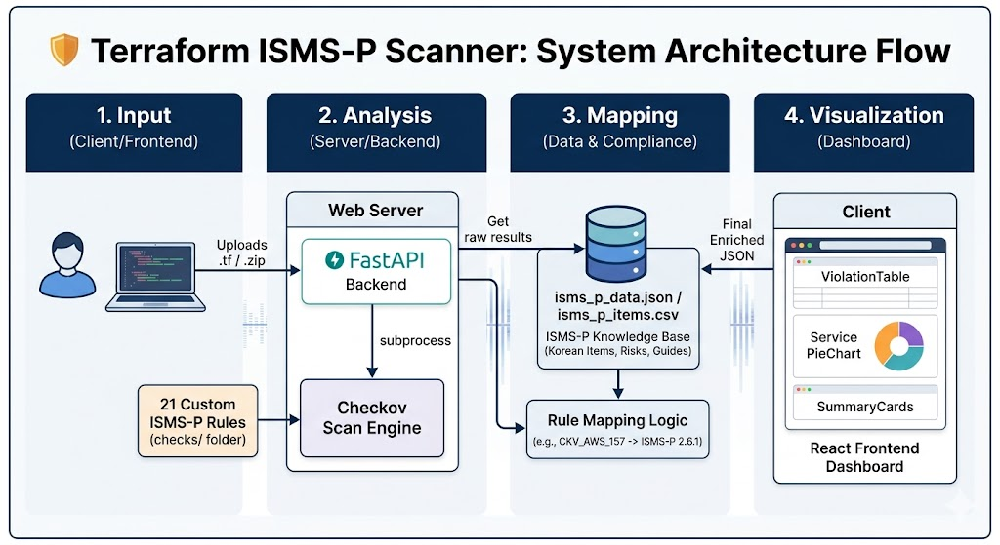

# Terraform Security Scanner

Terraform IaC 보안 취약점 분석부터 국내 ISMS-P 인증 항목 매핑까지 한 번에.

---

## 목차

- [프로젝트 개요](#1단계-프로젝트-개요-the-value)
   - [소개](#introduction)
   - [아키텍처 구조도](#️-architecture)
- [퀵 스타트](#2단계-퀵-스타트-the-guide)
   - [사전 요구사항](#사전-요구사항)   
   - [설치 방법 — Windows](#설치-방법--windows)
   - [설치 방법 — macOS](#설치-방법--macos)
   - [실행 방법](#실행-방법)
   - [TerraGoat로 테스트하기](#terragoat로-테스트하기)
   - [사용 방법](#사용-방법)
-[기술 상세](#3단계-기술-상세-the-deep-dive)
   - [기술 스택](#기술-스택)
   - [프로젝트 구조](#프로젝트-구조)
   - [자주 발생하는 오류](#자주-발생하는-오류)
   - [팀 설명](#팀-프로젝트-정보)

---

## [1단계] 프로젝트 개요 (The Value)

### 🌟**Introduction**

본 프로젝트는 클라우드 인프라 구축 시 발생하는 보안 약점을 사전에 탐지하고, 이를 **국내 보안 규정인 ISMS-P 인증 항목과 자동으로 매핑**해주는 DevSecOps 도구입니다.

### ✨**Key Features & Differentiation**

- **ISMS-P 특화 분석**: 단순한 보안 점검을 넘어, 실제 심사 항목과 연계된 한국어 가이드 제공.
- **21개 커스텀 보안 정책**: S3, IAM, RDS 등 핵심 서비스에 대한 국내 최적화 보안 룰 적용.
- **사용자 중심 대시보드**: 심각도별 요약 카드 및 서비스별 파이 차트를 통한 직관적 현황 파악.

### 🏗️ **Architecture**



1. **Input Phase (입력)**: 사용자가 React 웹 인터페이스를 통해 단일 .tf 파일 또는 프로젝트 압축 파일(.zip)을 업로드합니다.
2. **Analysis Phase (분석)**: FastAPI 백엔드가 파일을 수신하여 임시 디렉터리에 저장한 후, **21개의 ISMS-P 전용 커스텀 룰**이 포함된 Checkov 스캔 엔진을 subprocess로 실행합니다.
3. **Mapping Phase (매핑)**: 스캔 결과(Raw JSON)에서 추출된 보안 취약점 ID를 isms_p_data.json 지식 베이스와 매핑하여, 해당되는 **ISMS-P 인증 항목 번호와 한국어 대응 가이드**를 결합합니다.
4. **Visualization Phase (시각화)**: 가공된 최종 데이터를 프론트엔드로 전달하여 심각도별 요약 카드, 서비스별 파이 차트, 상세 취약점 테이블로 시각화합니다.

---

## [2단계] 퀵 스타트 (The Guide)

### 사전 요구사항

| 항목      | 권장 버전 | 용도                   |
| --------- | --------- | ---------------------- |
| Python    | 3.10 이상 | 백엔드 서버 실행       |
| Node.js   | 18 이상   | 프론트엔드 빌드        |
| npm       | 9 이상    | 프론트엔드 패키지 관리 |
| Terraform | 0.12 이상 | TerraGoat 실습 시 필요 |

> **Terraform은 TerraGoat 실습 시에만 필요합니다.** 웹 앱 자체 실행에는 불필요합니다.

---

### 설치 방법 — Windows

#### 1. Python 설치

1. [python.org](https://www.python.org/downloads/) 에서 Python 3.10 이상 설치 파일 다운로드
2. 설치 시 **"Add Python to PATH"** 체크박스를 반드시 선택한 후 설치
3. 설치 확인:
   ```cmd
   python --version
   ```

#### 2. Node.js 설치

1. [nodejs.org](https://nodejs.org/) 에서 LTS 버전 다운로드 및 설치
2. 설치 확인:
   ```cmd
   node --version
   npm --version
   ```

#### 3. Terraform 설치 (TerraGoat 실습 시)

1. [developer.hashicorp.com/terraform/install](https://developer.hashicorp.com/terraform/install) 에서 Windows용 zip 파일 다운로드
2. 압축 해제 후 `terraform.exe`를 시스템 PATH에 추가
   - 예: `C:\terraform\` 폴더에 복사 후 시스템 환경변수 PATH에 `C:\terraform` 추가
3. 설치 확인:
   ```cmd
   terraform --version
   ```

#### 4. 프로젝트 클론

```cmd
git clone <repository-url>
cd AWS_Terraform
```

#### 5. 백엔드 설정

```cmd
cd backend
python -m venv venv
venv\Scripts\activate
pip install -r requirements.txt
```

> **참고:** `venv\Scripts\activate` 실행 시 오류가 발생하면 PowerShell에서 아래 명령어를 먼저 실행하세요:
>
> ```powershell
> Set-ExecutionPolicy -ExecutionPolicy RemoteSigned -Scope CurrentUser
> ```

#### 6. 프론트엔드 설정

새 터미널 창을 열고:

```cmd
cd frontend
npm install
```

---

### 설치 방법 — macOS

#### 1. Python 설치

Homebrew를 사용하는 방법을 권장합니다.

**Homebrew가 없는 경우 먼저 설치:**

```bash
/bin/bash -c "$(curl -fsSL https://raw.githubusercontent.com/Homebrew/install/HEAD/install.sh)"
```

**Python 설치:**

```bash
brew install python@3.11
python3 --version
```

또는 [python.org](https://www.python.org/downloads/macos/) 에서 직접 다운로드할 수 있습니다.

#### 2. Node.js 설치

```bash
brew install node
node --version
npm --version
```

또는 [nodejs.org](https://nodejs.org/) 에서 macOS 설치 파일을 다운로드할 수 있습니다.

#### 3. Terraform 설치 (TerraGoat 실습 시)

```bash
brew tap hashicorp/tap
brew install hashicorp/tap/terraform
terraform --version
```

또는 [developer.hashicorp.com/terraform/install](https://developer.hashicorp.com/terraform/install) 에서 macOS 바이너리를 직접 다운로드할 수 있습니다.

#### 4. 프로젝트 클론

```bash
git clone <repository-url>
cd AWS_Terraform
```

#### 5. 백엔드 설정

```bash
cd backend
python3 -m venv venv
source venv/bin/activate
pip install -r requirements.txt
```

#### 6. 프론트엔드 설정

새 터미널 창을 열고:

```bash
cd frontend
npm install
```

---

### 실행 방법

백엔드와 프론트엔드를 **각각 별도의 터미널**에서 실행해야 합니다.

#### 데이터 변환

**Windows:**

```cmd
cd backend
venv\Scripts\activate
# 데이터 변환 (최초 실행 또는 CSV 수정 시)
python csv_to_json.py
```

**macOS:**

```bash
cd backend
source venv/bin/activate
# 데이터 변환 (최초 실행 또는 CSV 수정 시)
python3 csv_to_json.py
```

#### 백엔드 서버 실행

**Windows:**

```cmd
cd backend
venv\Scripts\activate
uvicorn main:app --reload --port 8000
```

**macOS:**

```bash
cd backend
source venv/bin/activate
uvicorn main:app --reload --port 8000
```

백엔드가 정상적으로 실행되면 `http://localhost:8000` 에서 API 서버가 시작됩니다.

#### 프론트엔드 서버 실행

**Windows / macOS 공통:**

```bash
cd frontend
npm run dev
```

프론트엔드가 정상적으로 실행되면 브라우저에서 `http://localhost:5173` 에 접속하세요.

---

### TerraGoat로 테스트하기

> ⚠️ **주의:** TerraGoat의 Terraform 파일은 실제 클라우드 환경에 **절대 배포하지 마세요.** 학습 및 테스트 목적으로만 사용하세요.

`terragoat/terraform/aws/` 경로의 `.tf` 파일을 개별 또는 ZIP으로 압축해 웹 앱에 업로드하면 됩니다.

**파일별 테스트 예시:**

| 파일         | 테스트 내용                                 |
| ------------ | ------------------------------------------- |
| `s3.tf`      | S3 버킷 퍼블릭 접근, 암호화, 로깅 취약점    |
| `iam.tf`     | IAM 과도한 권한, MFA 미설정 취약점          |
| `rds.tf`     | RDS 암호화, 퍼블릭 접근, 백업 미설정 취약점 |
| `ec2.tf`     | EC2 보안그룹, IMDSv2 미적용 취약점          |
| `eks.tf`     | EKS 클러스터 보안 설정 취약점               |
| `cloudtrail` | CloudTrail 로깅 미설정 취약점               |

**AWS 전체 파일을 ZIP으로 압축해 업로드하는 방법:**

**Windows:**

```cmd
cd terragoat\terraform\aws
powershell Compress-Archive -Path * -DestinationPath aws-terragoat.zip
```

**macOS:**

```bash
cd terragoat/terraform/aws
zip -r aws-terragoat.zip .
```

---

### 사용 방법

1. 브라우저에서 `http://localhost:5173` 접속
2. Terraform 파일(`.tf`) 또는 ZIP으로 압축한 Terraform 프로젝트 업로드
3. **스캔 시작** 버튼 클릭
4. 보안 취약점 분석 결과 확인
   - S3, IAM, RDS, CloudTrail, Security Group 등 카테고리별 취약점 표시
   - 심각도(CRITICAL / HIGH / MEDIUM / LOW)별 분류
   - ISMS-P 항목 매핑 및 항목별 수정 가이드 제공
   - 파이차트 및 요약 카드로 전체 현황 시각화

---

## [3단계] 기술 상세 (The Deep Dive)

### 기술 스택

| 카테고리         | 테스트 내용                                 |
| ------------ | ------------------------------------------- |
| `Backend`      | S3 버킷 퍼블릭 접근, 암호화, 로깅 취약점    |
| `Frontend`     | IAM 과도한 권한, MFA 미설정 취약점          |
| `Security`     | RDS 암호화, 퍼블릭 접근, 백업 미설정 취약점 |

### Security Rule Mapping

| ISMS-P 항목 | 주요 점검 내용                 | Check ID         |
| ----------- | ------------------------------ | ---------------- |
| 2.10.1      | 개인정보 보호를 위한 S3 암호화 | CKV_CUSTOM_S3_1  |
| 2.6.2       | 권한 부여 원칙에 따른 IAM 설정 | CKV_CUSTOM_IAM_4 |
| 2.6.1       | 네트워크 접근 제어 (RDS/SG)    | CKV_CUSTOM_RDS_2 |

### 프로젝트 구조

```
AWS_Terraform/
├── .gitignore
├── README.md
├── flowchart.html                         # 코드 실행 흐름도
├── backend/                              # FastAPI 백엔드
│   ├── main.py                           # 애플리케이션 진입점 (파일 업로드, 스캔 API)
│   ├── requirements.txt                  # Python 의존성 (fastapi, uvicorn, checkov, sqlalchemy 등)
|   ├── isms_p_items.csv                  # 원본 ISMS-P 매핑 데이터 리스트 (수정/관리용)
|   ├── isms_p_items.json                 # 변환 스크립트로 생성된 지식 베이스
|   ├── csv_to_json.py                    # CSV 데이터를 백엔드용 데이터로 변환하는 스크립트
│   ├── uploads/                          # 업로드 파일 임시 저장소
│   └── checks/                           # 커스텀 Checkov 보안 체크 모듈
│       ├── _utils.py                     # 공통 유틸리티
│       ├── s3/                           # S3 체크 (CKV_CUSTOM_S3_1~4)
│       ├── iam/                          # IAM 체크 (CKV_CUSTOM_IAM_1~4)
│       ├── rds/                          # RDS 체크 (CKV_CUSTOM_RDS_1~5)
│       ├── sg/                           # Security Group 체크 (CKV_CUSTOM_SG_1~5)
│       └── cloudtrail/                   # CloudTrail 체크 (CKV_CUSTOM_CT_1~3)
│
├── frontend/                             # React 프론트엔드
│   ├── index.html
│   ├── package.json                      # Node.js 의존성 (react, recharts, tailwindcss 등)
│   ├── package-lock.json                 # 의존성 버전 고정 파일 (자동 생성)
│   ├── vite.config.js                    # Vite 설정 (포트 5173, /scan 프록시 → 8000)
│   ├── tailwind.config.js
│   ├── postcss.config.js
│   └── src/
│       ├── main.jsx                      # React 진입점
│       ├── App.jsx                       # 루트 컴포넌트
│       ├── index.css
│       ├── api/
│       │   └── scanner.js                # 백엔드 API 호출 함수
│       ├── components/
│       │   ├── Navbar.jsx                # 상단 네비게이션
│       │   ├── FileUpload.jsx            # 파일 업로드 UI
│       │   ├── SummaryCards.jsx          # 취약점 요약 카드
│       │   ├── ServicePieChart.jsx       # 서비스별 파이차트
│       │   ├── ViolationTable.jsx        # 취약점 목록 테이블
│       │   ├── ViolationDetail.jsx       # 취약점 상세 뷰
│       │   └── SeverityBadge.jsx         # 심각도 뱃지
│       ├── data/
│       │   └── checkMetadata.js          # 체크 메타데이터 (ISMS-P 매핑 등)
│       └── utils/
│           └── scoring.js                # 점수 계산 유틸리티
│
└── terragoat/                            # 취약 Terraform 예제 모음 (테스트용)
    ├── terraform/
    │   ├── aws/                          # AWS 취약 예제
    │   │   ├── s3.tf                     # S3 버킷
    │   │   ├── iam.tf                    # IAM 정책/역할
    │   │   ├── rds.tf                    # RDS 인스턴스
    │   │   ├── ec2.tf                    # EC2 인스턴스
    │   │   ├── eks.tf                    # EKS 클러스터
    │   │   ├── elb.tf                    # 로드밸런서
    │   │   ├── lambda.tf                 # Lambda 함수
    │   │   ├── kms.tf                    # KMS 키
    │   │   ├── ecr.tf                    # ECR 레지스트리
    │   │   ├── es.tf                     # Elasticsearch
    │   │   ├── neptune.tf                # Neptune DB
    │   │   ├── db-app.tf                 # DB 앱 인프라
    │   │   ├── consts.tf                 # 상수 정의
    │   │   └── providers.tf              # AWS 프로바이더 설정
    │   ├── azure/                        # Azure 취약 예제 (AKS, SQL, Storage 등)
    │   ├── gcp/                          # GCP 취약 예제 (GKE, GCS, BigQuery 등)
    │   ├── alicloud/                     # Alibaba Cloud 취약 예제
    │   └── oracle/                       # Oracle Cloud 취약 예제
    └── packages/                         # 취약 패키지 예제 (SCA 테스트용)
        ├── requirements.txt              # Python 취약 패키지 (django==1.2)
        ├── pom.xml                       # Java 취약 패키지
        └── node/                         # Node.js 취약 패키지
```

---

### 자주 발생하는 오류

**`checkov` 명령어를 찾을 수 없는 경우**
가상환경이 활성화되어 있는지 확인하세요. (`venv\Scripts\activate` 또는 `source venv/bin/activate`)

**포트 충돌 오류**
8000 또는 5173 포트가 이미 사용 중인 경우 실행 중인 다른 프로세스를 종료하거나 포트를 변경하세요.

**`npm install` 실패**
Node.js 버전이 18 미만인 경우 업그레이드가 필요합니다.

**`terraform` 명령어를 찾을 수 없는 경우**
Terraform 바이너리가 PATH에 등록되어 있는지 확인하세요. 웹 앱 실행 자체에는 영향이 없습니다.

---

### 주의사항

- 본 도구에서 사용하는 **TerraGoat** 예제는 학습용입니다. 실제 클라우드 환경(Production)에 배포할 경우 심각한 보안 사고로 이어질 수 있으니 주의하시기 바랍니다.
- 스캔 결과는 참고용이며, 실제 ISMS-P 인증 심사 결과와는 차이가 있을 수 있습니다.

---

### 팀 프로젝트 정보

- **프로그램** : S-Developer 4기
- **개발 인원** : 5명
